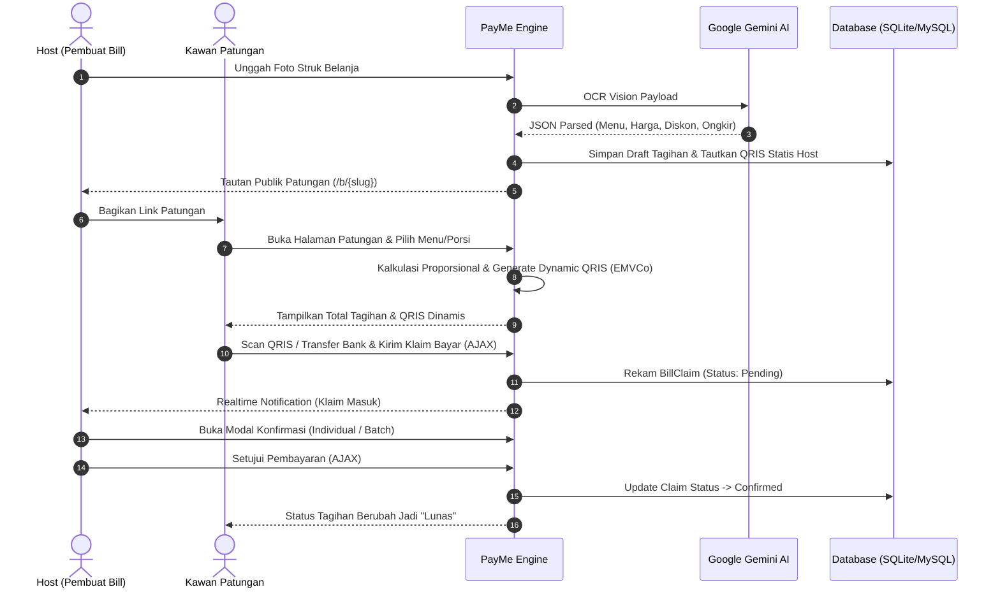

<p align="center">
  
</p>

<h1 align="center">PayMe &bull; Split Bill & Dynamic QRIS Generator</h1>

<p align="center">
  <strong>Bagi tagihan patungan lebih adil, bayar pakai QRIS dinamis lebih praktis.</strong><br>
  Aplikasi web modern untuk menghitung split bill secara proporsional dengan konversi QRIS statis ke dinamis secara otomatis.
</p>

<p align="center">
  
  
  
  
  
</p>

---

## 💡 Tentang PayMe

Sering makan bareng teman kantor atau nongkrong rame-rame tapi ribet saat bagi tagihan?
- Ada yang cuma makan setengah porsi?
- Ada biaya ongkir, diskon promo, pajak restoran (PB1), atau *service charge* yang harus dibagi rata secara adil?
- Host repot harus cek mutasi satu-satu dan teman malas ketik nominal transfer manual?

**PayMe** hadir menyelesaikan masalah ini dengan mengkombinasikan kalkulasi proporsional presisi, OCR struk belanja bertenaga **AI Vision (Gemini)**, dan konversi otomatis **QRIS Statis ke QRIS Dinamis ber-nominal pas** (EMVCo compliant).

---

## ✨ Fitur Utama

### 1. ⚡ Konversi QRIS Dinamis Otomatis (EMVCo Compliant)
- Host hanya perlu mendaftarkan **1 QRIS statis toko/pribadi** (BCA, Mandiri, GoPay, DANA, OVO, ShopeePay, Nobu, LinkAja, dll).
- Saat kawan patungan memilih menu dan mendapatkan total tagihan, PayMe otomatis mengonversi kode QRIS tersebut menjadi **QRIS Dinamis dengan nominal presisi**. Kawan patungan cukup scan QR &mdash; nominal pembayaran langsung terisi otomatis di aplikasi m-Banking/e-Wallet tanpa takut salah ketik.

### 2. 🧾 OCR Scan Struk dengan AI Vision (Google Gemini)
- Unggah satu atau beberapa foto struk restoran/belanja.
- AI Vision mengekstrak daftar menu pesanan, kuantitas, harga satuan, subtotal, potongan diskon/voucher promo, ongkir, serta biaya layanan secara otomatis dalam hitungan detik.

### 3. ⚖️ Pembagian Proporsional yang Adil
- Diskon promo, ongkos kirim (*delivery fee*), dan biaya layanan dialokasikan secara **proporsional berbasis rasio subtotal pesanan** tiap peserta, bukan sekadar dibagi rata (*flat*), sehingga peserta yang memesan lebih sedikit tidak menanggung beban diskon/biaya yang tidak adil.

### 4. 🍕 Fractional Portion Sharing (Patungan Porsi)
- Mendukung pemesanan porsi pecahan (misal: 1 porsi pizza atau lauk dimakan berdua = masing-masing 1/2 porsi).
- Sistem membatasi klaim porsi secara realtime agar tidak melebihi kuantitas yang ada di struk.

### 5. 🚀 100% Zero-Reload (Seamless AJAX Experience)
- Seluruh interaksi pengguna berjalan mulus tanpa reload halaman:
  - Stepper penambahan porsi dan kalkulasi tagihan realtime.
  - Submit klaim pembayaran instan dengan proteksi nama unik (*Unique Payer Validation*).
  - Modal **Rincian Pembayar per Menu**: Klik kartu menu untuk melihat siapa saja yang memesan/membayar menu tersebut.
  - Host **Konfirmasi Klaim Sekaligus (*Batch Approval Modal*)** atau konfirmasi perorangan.
  - Penolakan / pembatalan klaim yang otomatis memulihkan sisa porsi menu secara instan.

### 6. 💳 Manajemen Rekening & QRIS Terdaftar
- Dashboard host terintegrasi dengan halaman pengelolaan rekening (`/payment-methods`).
- Input cepat rekening bank/e-wallet dengan tombol **Preset Bank** (*BCA, Mandiri, BRI, BNI, BSI, CIMB Niaga, Bank Jago, SeaBank, Blu, DANA, GoPay, OVO, ShopeePay*).
- Scanner client-side **jsQR** untuk auto-detect string QRIS dari gambar struk/foto QR dan **EMVCo TLV Parser** presisi untuk mengekstrak Nama & Kota Merchant.
- Pengaturan Rekening Utama / QRIS Utama (*Default Selection*).

### 7. 📱 Mobile-First & Tactile UI
- Dirancang khusus untuk pengalaman mobile web yang nyaman, tactile button animations, visual micro-interactions, modal popups yang bersih, dan notifikasi elegan via **Notiflix**.

---

## 🛠️ Tech Stack

| Layer | Teknologi |
|---|---|
| **Backend Framework** | [Laravel 12.x](https://laravel.com/) (PHP 8.4) |
| **Frontend Styling** | [Tailwind CSS v4](https://tailwindcss.com/) & [Plus Jakarta Sans](https://fonts.google.com/specimen/Plus+Jakarta+Sans) |
| **Icons & UI Feedback** | [Font Awesome Pro](https://fontawesome.com/) & [Notiflix Suite](https://notiflix.github.io/) |
| **QR Code & Scanner** | [jsQR](https://github.com/cozmo/jsQR) (Decoder) & [QRCode.js](https://davidshimjs.github.io/qrcodejs/) (Renderer) |
| **AI Vision Model** | [Google Gemini 2.5 Flash API](https://ai.google.dev/) (Structured OCR Extraction) |
| **Database Engine** | SQLite (Default) / MySQL / PostgreSQL |
| **Code Formatter & QA** | [Laravel Pint](https://laravel.com/docs/pint) & [PHPUnit](https://phpunit.de/) |

---

## 🚀 Panduan Instalasi (Getting Started)

### Prasyarat
- PHP `>= 8.4` (dengan ekstensi `pdo`, `mbstring`, `openssl`, `curl`, `gd` / `imagick`, `fileinfo`)
- [Composer](https://getcomposer.org/)
- [Node.js](https://nodejs.org/) (v20+ recommended) & NPM

### Langkah-langkah

1. **Clone repositori**:
   ```bash
   git clone https://github.com/username/payme.git
   cd payme
   ```

2. **Install dependensi PHP & JavaScript**:
   ```bash
   composer install
   npm install
   ```

3. **Salin file konfigurasi environment**:
   ```bash
   cp .env.example .env
   ```

4. **Generate Application Key**:
   ```bash
   php artisan key:generate
   ```

5. **Konfigurasi Database & API Key di `.env`**:
   ```env
   APP_NAME=PayMe
   APP_URL=http://localhost:8000

   DB_CONNECTION=sqlite
   # Atau jika menggunakan MySQL:
   # DB_CONNECTION=mysql
   # DB_HOST=127.0.0.1
   # DB_PORT=3306
   # DB_DATABASE=payme
   # DB_USERNAME=root
   # DB_PASSWORD=

   # Google Gemini AI Key untuk fitur Scan Struk (Opsional):
   GEMINI_API_KEY=your_gemini_api_key_here
   ```

6. **Jalankan Migrasi Database & Buat Symbolic Link Storage**:
   ```bash
   php artisan migrate
   php artisan storage:link
   ```

7. **Kompilasi Aset Frontend**:
   ```bash
   # Mode Development
   npm run dev

   # Atau Build Production
   npm run build
   ```

8. **Jalankan Local Development Server**:
   ```bash
   php artisan serve
   ```
   Buka peramban Anda di `http://127.0.0.1:8000`.

---

## 🧪 Menjalankan Automated Tests

Seluruh skenario pengujian Feature dan Unit tests dapat dijalankan menggunakan PHPUnit:

```bash
# Menjalankan seluruh test suite
php artisan test

# Format ringkas (compact)
php artisan test --compact

# Format kode dengan Laravel Pint
vendor/bin/pint --format agent
```

---

## 📐 Arsitektur Alur Transaksi Patungan



---

## 🔒 Standar Keamanan & Validasi

- **Proteksi CSRF**: Seluruh request AJAX dan form POST dilindungi token CSRF Laravel.
- **Isolasi Akun Host**: Seluruh endpoint mutasi QRIS, Rekening Bank, dan Approval Tagihan diverifikasi kepemilikannya terhadap user yang sedang login (`Auth::id()`).
- **Validasi Nama Unik**: Mencegah tabrakan nama pembayar ganda dalam satu tagihan patungan.
- **Standard EMVCo QRIS Parsing**: Parsing Tag-Length-Value (TLV) sekuensial yang aman dari kesalahan pencocokan sub-tag perbankan.

---

## 📄 Lisensi

Proyek ini dilisensikan di bawah lisensi terbuka [MIT License](LICENSE).

---

<p align="center">
  Dibuat dengan ❤️ untuk kemudahan patungan dan transparansi pembayaran bersama.
</p>
